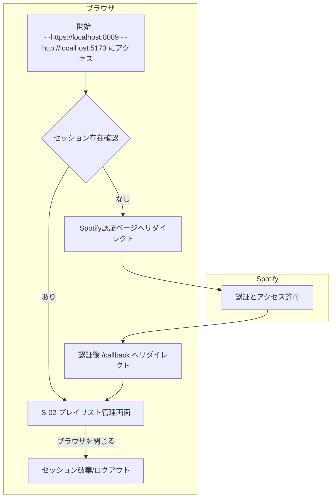

## Spotifyプレイリスト管理アプリケーション 外部仕様書

**文書バージョン:** 1.2
**作成日:** 2025/06/11
**更新日:** 2025/06/12
**対象読者:** 開発担当者、テスト担当者

### 1. はじめに

#### 1.1. 本書の目的
本書は、「Spotifyプレイリスト管理アプリケーション 要件定義書【最終版 v2】」に基づき、アプリケーションの画面仕様、機能仕様、および非機能仕様を詳細に定義することを目的とします。開発者は本書に従って実装を行ってください。

#### 1.2. アプリケーション概要
本アプリケーションは、ユーザーのSpotifyアカウントと連携し、Webブラウザ上でプレイリストおよび楽曲を管理するローカルWebアプリケーションです。主な機能として、不要なプレイリストや楽曲を選択し、一括で削除する機能を提供します。

#### 1.3. 参考文献
本書で記述されるSpotify Web APIの仕様は、公式ドキュメントに基づいています。実装にあたり、リクエストパラメータやレスポンス形式などの詳細な情報が必要な場合は、以下の公式ドキュメントを適宜参照してください。
- **Spotify Web API Documentation:** https://developer.spotify.com/documentation/web-api

### 2. システム仕様

#### 2.1. システム構成
- **種別:** Webアプリケーション
- **フロントエンド:** HTML, CSS, JavaScript
- **バックエンド:** Node.js (Expressフレームワークを想定)
- **実行環境:** ローカルマシン
- **アクセスURL:** ~~`https://localhost:8089`~~ `http://localhost:5173`
- **通信プロトコル:** ~~HTTPS (自己署名証明書を使用)~~ HTTP

#### 2.2. 動作環境
- **対応ブラウザ:** Google Chrome, Mozilla Firefox, Apple Safari, Microsoft Edge の最新バージョン

### 3. 画面仕様

#### 3.1. 画面一覧
| 画面ID | 画面名 | URLパス | 概要 |
| :--- | :--- | :--- | :--- |
| S-01 | （ログインリダイレクト処理） | `/` | 初期アクセス時にSpotify認証へリダイレクトする。実質的な画面表示はない。 |
| S-02 | プレイリスト管理画面 | `/` | ログイン後に表示されるメイン画面。プレイリストと楽曲の管理を行う。 |

#### 3.2. 画面遷移図

#### 3.3. 画面詳細

##### 3.3.1. S-01: ログインリダイレクト処理
- **URL:** ~~`https://localhost:8089/`~~ `http://localhost:5173/`
- **概要:** ユーザーが初回アクセスした際のサーバーサイドの処理。
- **振る舞い:**
    1. サーバーはリクエストを受け取ると、ユーザーのセッションにアクセストークンが存在するか確認する。
    2. アクセストークンが存在しない場合、Spotifyの認証ページへ302リダイレクトする。
    3. アクセストークンが存在する場合、S-02 プレイリスト管理画面のHTMLをレスポンスとして返す。

##### 3.3.2. S-02: プレイリスト管理画面
- **URL:** ~~`https://localhost:8089/`~~ `http://localhost:5173/` (ログイン成功後に表示)
- **画面レイアウト:**
    - **ヘッダー:** アプリケーションのタイトルと、**テーマ切替ボタン**を表示する。
    - **メインコンテンツ:** ログインユーザーのプレイリスト一覧を表示するエリア。
    - **フッター:** 「Delete」ボタンを配置するエリア。このエリアは画面下部に固定表示することが望ましい。

- **表示項目とコンポーネント:**
    1.  **テーマ切替ボタン (`<button id="theme-toggle-button">`)**
        -   **配置:** ヘッダーの右端に配置する。
        -   **表示:** 現在のテーマに応じてアイコンを切り替える（例: ライトモード時は月のアイコン、ダークモード時は太陽のアイコン）。
        -   **振る舞い:** クリックするたびに、ライトモードとダークモードがトグルで切り替わる。

    2.  **プレイリスト一覧 (`
`)**
        -   ログインユーザーの全プレイリストを縦にリスト表示する。
        -   各プレイリストはHTMLの`
`タグで実装する。
        -   **`
`部 (プレイリスト情報):**
            -   **チェックボックス:** このプレイリスト自体を選択するためのチェックボックス。
            -   **カバー画像:** 60x60ピクセルのプレイリストカバー画像。
            -   **タイトル:** プレイリストのタイトル。
        -   **展開部 (楽曲一覧):**
            -   初期状態では非表示。`
`部をクリックすると展開される。
            -   内部にはそのプレイリストに含まれる楽曲がリスト表示される。
            -   楽曲のロード中は、このエリアにローディングインジケーターを表示する。

    3.  **楽曲一覧 (`<ul>` or `
`)**
        -   各楽曲はリストアイテムとして表示する。
        -   **表示項目:**
            -   **チェックボックス:** この楽曲を選択するためのチェックボックス。
            -   **アルバムカバー画像:** 40x40ピクセルのアルバムカバー画像。
            -   **楽曲情報:** 「曲のタイトル - アーティスト名」の形式で表示する。
        -   **表示制御:**
            -   ユーザーが編集権限を持たないプレイリストの場合、配下の楽曲のチェックボックスは非表示または非活性（`disabled`属性を付与）とする。

    4.  **削除ボタン (`<button id="delete-button">`)**
        -   画面下部に配置する。
        -   **初期状態:** 非活性（`disabled`属性を付与）。
        -   **活性化条件:** 画面上のいずれかのチェックボックスが1つでもチェックされると、活性化（クリック可能）する。
        -   **非活性化条件:** チェックされているチェックボックスが0個になると、非活性化する。

- **配色:**
    - **ライトモード（デフォルト）:** 白系の背景に黒系のテキスト。
    - **ダークモード:** 黒系の背景に白系のテキスト。コントラスト比に配慮し、視認性を確保する。

### 4. 機能仕様

#### 4.1. 機能一覧
| 機能ID | 機能名 | 関連画面 |
| :--- | :--- | :--- |
| F-01 | Spotify認証機能 | S-01 |
| F-02 | プレイリスト一覧表示機能 | S-02 |
| F-03 | 楽曲一覧表示機能 | S-02 |
| F-04 | アイテム選択機能 | S-02 |
| F-05 | アイテム削除機能 | S-02 |
| F-06 | テーマ切替機能 | S-02 |

#### 4.2. 機能詳細

##### 4.2.1. F-01: Spotify認証機能
1.  **トリガー:** ユーザーが ~~`https://localhost:8089`~~ `http://localhost:5173` にアクセスし、有効なセッションが存在しない場合。
2.  **処理フロー (バックエンド):**
    1.  Spotify認証URLを生成し、ユーザーをリダイレクトさせる。必要なスコープは `playlist-read-private`, `playlist-read-collaborative`, `playlist-modify-public`, `playlist-modify-private` とする。
    2.  ユーザーがSpotifyで認証後、リダイレクトURI (~~`https://localhost:8089/callback`~~ `http://localhost:5173/callback`) で認証コードを受け取る。
    3.  受け取った認証コードと、`.env`ファイルから読み込んだ`Client ID`, `Client Secret`を使い、Spotify APIにアクセストークンをリクエストする。
    4.  取得したアクセストークンをサーバーサイドのセッションに保存する。
    5.  ユーザーをルートパス (`/`) にリダイレクトする。これによりS-02画面が表示される。
3.  **ログアウト:** ブラウザを閉じることでセッションが破棄され、事実上のログアウトとなる。明示的なログアウトボタンは設けない。
4.  **補足:** 認証フローの実装にあたっては、Authorization Code Flowの詳細を公式ドキュメントで確認すること。

##### 4.2.2. F-02: プレイリスト一覧表示機能
1.  **トリガー:** S-02画面の初期表示時。
2.  **処理フロー (フロントエンド):**
    1.  画面ロード完了後、バックエンドのAPIエンドポイント（例: `/api/playlists`）にGETリクエストを送信する。
    2.  バックエンドはセッション内のアクセストークンを使い、Spotify API (`GET /v1/me/playlists`) を呼び出す。
    3.  取得したプレイリストデータをフロントエンドに返す。
    4.  フロントエンドは受け取ったデータに基づき、S-02画面のメインコンテンツにプレイリスト一覧を動的に生成・表示する。
3.  **補足:** 利用するAPIエンドポイントのパラメータやレスポンス形式の詳細は、公式ドキュメントで確認すること。

##### 4.2.3. F-03: 楽曲一覧表示機能
1.  **トリガー:** ユーザーがS-02画面で特定のプレイリスト（`
`タグ）をクリックして展開する。
2.  **処理フロー (フロントエンド):**
    1.  対象の`
`タグが初めて展開される際、バックエンドのAPIエンドポイント（例: `/api/playlists/{playlist_id}/tracks`）にGETリクエストを送信する。
    2.  バックエンドはSpotify API (`GET /v1/playlists/{playlist_id}/tracks`) を呼び出し、楽曲データを取得してフロントエンドに返す。
    3.  フロントエンドは受け取ったデータに基づき、展開された`
`タグ内に楽曲一覧を動的に生成・表示する。
    4.  一度取得した楽曲データは、ページをリロードするまでクライアントサイドでキャッシュし、再展開時にはAPIリクエストを送信しない。
    5.  プレイリストの編集権限（`playlist.owner.id`が自身のIDと一致するか、`playlist.collaborative`が`true`か）を判定し、権限がない場合は楽曲のチェックボックスを非表示または非活性にする。
3.  **補足:** 利用するAPIエンドポイントのパラメータやレスポンス形式の詳細は、公式ドキュメントで確認すること。

##### 4.2.4. F-04: アイテム選択機能
1.  **トリガー:** ユーザーがプレイリストまたは楽曲のチェックボックスをクリックする。
2.  **処理フロー (フロントエンド):**
    1.  クリックされたチェックボックスのON/OFF状態を切り替える。
    2.  画面内の全てのチェックボックスの状態をスキャンする。
    3.  チェックされているボックスが1つ以上あれば、「Delete」ボタンの`disabled`属性を解除する。
    4.  チェックされているボックスが0個であれば、「Delete」ボタンに`disabled`属性を付与する。

##### 4.2.5. F-05: アイテム削除機能
1.  **トリガー:** ユーザーが活性化された「Delete」ボタンをクリックする。
2.  **処理フロー (フロントエンド & バックエンド):**
    1.  **[FE]** ブラウザの確認ダイアログ (`window.confirm`) を表示する。メッセージ: 「選択したアイテムを削除します。この操作は元に戻せません。よろしいですか？」
    2.  **[FE]** ユーザーが「キャンセル」をクリックした場合、処理を中断する。
    3.  **[FE]** ユーザーが「OK」をクリックした場合、画面全体にローディングインジケーターを表示し、以下の処理を開始する。
    4.  **[FE]** チェックされている全アイテムの情報を収集する。
        -   プレイリスト: `playlist_id`
        -   楽曲: `track_uri` と、その楽曲が属する `playlist_id`
    5.  **[FE]** 収集した情報をJSON形式にまとめ、バックエンドの削除APIエンドポイント（例: `/api/delete-items`）にPOSTリクエストを送信する。
    6.  **[BE]** リクエストを受け取り、削除処理を実行する。
        -   **プレイリスト削除:** `playlist_id` のリストを元に、Spotify API (`DELETE /v1/playlists/{playlist_id}/followers`) をループ実行する。
        -   **楽曲削除:** 楽曲を`playlist_id`ごとにグループ化する。各グループに対し、Spotify API (`DELETE /v1/playlists/{playlist_id}/tracks`) を実行する。
        -   楽曲リストが100件を超える場合は、100件ずつのチャンクに分割して複数回APIを呼び出す。
    7.  **[BE]** 全ての削除処理が完了したら、成功ステータス（例: `200 OK`）をフロントエンドに返す。エラーが発生した場合は、エラー内容を含むステータス（例: `500 Internal Server Error`）を返す。
    8.  **[FE]** 成功レスポンスを受け取ったら、ローディングインジケーターを非表示にし、「削除が完了しました。」というメッセージを短時間表示する。その後、プレイリスト一覧を再取得し、画面を最新の状態に更新する。
    9.  **[FE]** エラーレスポンスを受け取った場合は、ローディングインジケーターを非表示にし、「エラーが発生しました。削除に失敗した可能性があります。」といったエラーメッセージを表示する。
3.  **補足:** 削除APIのリクエストボディの形式や仕様の詳細は、公式ドキュメントで確認すること。

##### 4.2.6. F-06: テーマ切替機能
1.  **トリガー:** ユーザーがS-02画面のヘッダーにあるテーマ切替ボタンをクリックする。
2.  **処理フロー (フロントエンド):**
    1.  **初期表示:** ページ読み込み時、ブラウザの`localStorage`に保存されたテーマ設定を確認する。設定が存在しない場合は、ライトモードをデフォルトとして適用する。
    2.  **クリック処理:** ボタンがクリックされると、現在のテーマ設定を判定する。
    3.  現在のテーマがライトモードの場合、ダークモードに切り替える。
        -   `<body>`タグにダークモード用のCSSクラス（例: `dark-mode`）を付与する。
        -   ボタンの表示をダークモードを示すアイコン（例: 月）からライトモードを示すアイコン（例: 太陽）に変更する。
    4.  現在のテーマがダークモードの場合、ライトモードに切り替える。
        -   `<body>`タグからダークモード用のCSSクラスを削除する。
        -   ボタンの表示をライトモードを示すアイコンからダークモードを示すアイコンに変更する。
    5.  **状態保存:** 切り替えた後のテーマの状態（例: 'light' または 'dark'）を`localStorage`に保存する。これにより、ユーザーがブラウザを再起動したりページをリロードしたりしても、選択したテーマが維持される。

### 5. 非機能仕様

#### 5.1. ユーザビリティ
- **レスポンシブデザイン:** PCブラウザのウィンドウ幅に合わせてレイアウトが崩れないようにする。
- **フィードバック:**
    - **API通信中:** 楽曲一覧のロード時や削除処理実行時には、ローディングインジケーター（スピナー等）を表示し、ユーザーに処理中であることを明示する。
    - **処理完了:** 削除完了後には、成功メッセージを画面上に表示する。
- **テーマ選択:** ユーザーの好みに合わせて、ライトモードとダークモードを切り替えられる機能を提供する。選択したテーマはブラウザを閉じても維持される。

#### 5.2. パフォーマンス
- **APIリクエストの最適化:** 一度展開して取得したプレイリスト内の楽曲データは、ページをリロードするまでクライアントサイドのJavaScriptオブジェクトにキャッシュする。これにより、同じプレイリストを再度展開した際の不要なAPIコールを防ぐ。

#### 5.3. セキュリティ
- **認証情報管理:** Spotify APIの `Client ID`, `Client Secret` は、プロジェクトルートの `.env` ファイルに定義し、バックエンドサーバー起動時に環境変数として読み込む。`.env` ファイルは `.gitignore` に追加し、バージョン管理対象外とする。
- **秘密情報の秘匿:** `Client Secret` はバックエンドでのみ使用し、フロントエンドのコードには一切含めない。
- **通信の暗号化:** ~~ローカルサーバーとブラウザ間の通信は、自己署名証明書を用いたHTTPSで行う。~~ ローカル環境のため、HTTPで通信する。

#### 5.4. エラーハンドリング
- **APIエラー:** Spotify APIからのエラーレスポンス（レートリミット超過、認証エラー等）を受け取った場合、バックエンドは適切なHTTPステータスコードをフロントエンドに返し、フロントエンドはユーザーに「エラーが発生しました: [エラー内容]」といった形式で通知する。
- **通信エラー:** ネットワーク切断等でバックエンドとの通信に失敗した場合、フロントエンドは「サーバーとの通信に失敗しました。ネットワーク接続を確認してください。」といったメッセージを表示する。

### 6. 外部インターフェース仕様

#### 6.1. Spotify Web API
本アプリケーションは、Spotify Web APIを利用して機能を実現します。APIの利用規約およびデザインガイドラインを遵守すること。詳細な仕様は公式ドキュメント (https://developer.spotify.com/documentation/web-api) を参照してください。

##### 6.1.1. 利用APIエンドポイント一覧
| HTTPメソッド | エンドポイント | 機能 |
| :--- | :--- | :--- |
| `GET` | `/v1/me/playlists` | F-02: プレイリスト一覧表示 |
| `GET` | `/v1/playlists/{playlist_id}/tracks` | F-03: 楽曲一覧表示 |
| `DELETE` | `/v1/playlists/{playlist_id}/followers` | F-05: プレイリスト削除（フォロー解除） |
| `DELETE` | `/v1/playlists/{playlist_id}/tracks` | F-05: 楽曲削除 |

##### 6.1.2. レートリミット対応
- Spotify APIのレートリミットに抵触した場合、APIは`429 Too Many Requests`ステータスコードと`Retry-After`ヘッダーを返す。
- 現状では、本アプリケーションのユースケースでレートリミットに達する可能性は低いと想定するが、万が一429エラーを受け取った場合は、処理を中断し、ユーザーに「時間をおいて再度お試しください。」というエラーメッセージを表示する。自動リトライ処理は実装しない。

--- END OF FILE ---