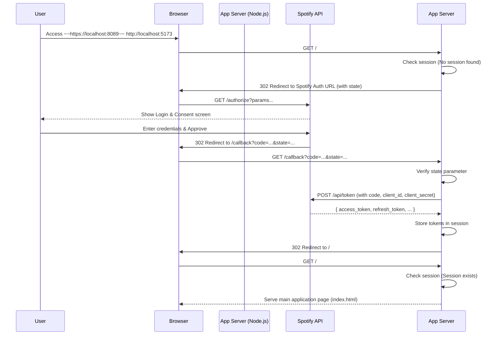

### 詳細仕様書（内部設計書） - F-01: Spotify認証機能

#### 1. 機能概要
SpotifyのOAuth 2.0 Authorization Code Flowを利用してユーザー認証を行う。バックエンド（Node.js/Express）で認証処理とトークン管理を一元的に行い、アクセストークンなどの機密情報をクライアントサイド（ブラウザ）に一切漏洩させないセキュアな設計とする。セッションはブラウザを閉じるまで有効とし、アプリケーションへのアクセスごとに認証状態をチェックする。

#### 2. モジュール構成と役割
本機能は、コードの保守性と拡張性を高めるため、役割ごとにファイルを分割して実装する。

| ファイル/ディレクトリ         | 役割                                                                                             |
| :---------------------------- | :----------------------------------------------------------------------------------------------- |
| `server.js`                   | Expressサーバーの起動、~~HTTPSサーバー~~HTTPサーバーの構築、ミドルウェアの適用、ルーティングの読み込みを行うエントリーポイント。 |
| `.env`                        | `CLIENT_ID`, `CLIENT_SECRET`, `SESSION_SECRET` などの機密情報や設定値を格納する。                  |
| `routes/auth.js`              | 認証関連のエンドポイント (`/`, `/callback`) のルーティングを定義し、対応するコントローラー関数を割り当てる。 |
| `controllers/authController.js` | 各エンドポイントで実行される具体的なロジック（Spotifyへのリダイレクト、トークン取得、セッション管理）を実装した関数群。 |
| `middleware/session.js`       | `express-session` ライブラリの設定を定義し、エクスポートする。                                     |

#### 3. 使用ライブラリ/モジュール

| ライブラリ/モジュール名 | 用途                                                              |
| :---------------------- | :---------------------------------------------------------------- |
| `express`               | Webアプリケーションフレームワーク。                               |
| `express-session`       | サーバーサイドでのセッション管理。                                |
| `dotenv`                | `.env`ファイルから環境変数を読み込む。                            |
| `axios`                 | Spotify APIへのHTTPリクエスト（トークン取得など）を行う。         |
| ~~`https` (Node.js標準)~~   | ~~自己署名証明書を使い、HTTPSサーバーを起動する。~~ （HTTPを使用するため不要）                   |
| ~~`fs` (Node.js標準)~~      | ~~SSL証明書ファイルを読み込む。~~ （HTTPを使用するため不要）                                     |
| `crypto` (Node.js標準)  | CSRF対策用のランダムな`state`文字列を生成する。                   |

#### 4. シーケンス図
ユーザー、ブラウザ、アプリケーションサーバー、Spotify API間の認証フローを以下に示す。



#### 5. エンドポイントと処理詳細

##### 5.1. `GET /`
-   **役割:** アプリケーションのルートエンドポイント。認証状態を判別し、未認証ならログイン処理を開始、認証済みならメイン画面を表示する。
-   **コントローラー:** `controllers/authController.js` -> `handleRootAccess`
-   **処理フロー:**
    1.  `req.session.access_token` が存在するかチェックする。
    2.  **存在する場合 (認証済み):** メインのHTMLファイル (`public/index.html`) をレスポンスとして返す。
    3.  **存在しない場合 (未認証):**
        a. `crypto.randomBytes(16).toString('hex')` でランダムな`state`文字列を生成し、`req.session.state`に保存する。
        b. 必要なスコープ (`playlist-read-private`, `playlist-read-collaborative`, `playlist-modify-public`, `playlist-modify-private`) をスペース区切りで連結した文字列を準備する。
        c. Spotifyの認証URL (`https://accounts.spotify.com/authorize`) を生成する。クエリパラメータは以下の通り。
        -   `response_type`: `code`
        -   `client_id`: `process.env.CLIENT_ID`
        -   `scope`: (b)で準備したスコープ文字列
        -   `redirect_uri`: `process.env.REDIRECT_URI`
        -   `state`: (a)で生成した`state`文字列
        d. `res.redirect()`で生成したURLにリダイレクトする。

##### 5.2. `GET /callback`
-   **役割:** Spotifyからの認証コールバックを受け取り、アクセストークンを取得してセッションに保存する。
-   **コントローラー:** `controllers/authController.js` -> `handleCallback`
-   **処理フロー:**
    1.  クエリパラメータから`code`と`state`を取得する。
    2.  セッションに保存した`req.session.state`と、受け取った`state`が一致するか検証する。
    3.  不一致の場合、CSRF攻撃の可能性があるため、400 Bad Requestを返し、エラーログを記録して処理を中断する。
    4.  `axios`を使い、Spotifyのトークンエンドポイント (`https://accounts.spotify.com/api/token`) にPOSTリクエストを送信する。
        -   **リクエストヘッダー:**
            -   `Content-Type`: `application/x-www-form-urlencoded`
            -   `Authorization`: `Basic <base64エンコードされた "CLIENT_ID:CLIENT_SECRET">`
        -   **リクエストボディ (URLエンコード形式):**
            -   `grant_type`: `authorization_code`
            -   `code`: (1)で取得した認証コード
            -   `redirect_uri`: `process.env.REDIRECT_URI`
    5.  レスポンスとして受け取った`access_token`, `refresh_token`, `expires_in`をセッションに保存する。
        -   `req.session.access_token = response.data.access_token;`
        -   `req.session.refresh_token = response.data.refresh_token;`
        -   `req.session.expires_at = Date.now() + response.data.expires_in * 1000;`
    6.  処理完了後、ルートURL (`/`) にリダイレクトする。

#### 6. データ構造

##### 6.1. セッションデータ (`req.session`)
サーバーサイドのセッションに以下の情報を保存する。

| キー            | 型     | 説明                                                                                                 |
| :-------------- | :----- | :--------------------------------------------------------------------------------------------------- |
| `state`         | String | CSRF対策用のランダムな文字列。認証リクエスト時に生成し、コールバック時に検証後、破棄する。             |
| `access_token`  | String | Spotify APIへのアクセスに使用するトークン。                                                          |
| `refresh_token` | String | アクセストークンの有効期限が切れた際に、新しいトークンを再取得するために使用する。**（注1）**         |
| `expires_at`    | Number | アクセストークンの有効期限を示すUNIXタイムスタンプ（ミリ秒）。**（注1）**                              |

**（注1）** `refresh_token`と`expires_at`は、将来的にアクセストークンの自動更新機能を実装する際のために保存します。本アプリケーションの現行仕様では直接使用しません。

#### 7. ミドルウェア実装

##### 7.1. セッション設定 (`middleware/session.js`)
`express-session`のミドルウェア設定。ブラウザを閉じるとセッションが切れるように`cookie.maxAge`は`null`（または未設定）にする。

```javascript
// middleware/session.js
const session = require('express-session');

module.exports = session({
    secret: process.env.SESSION_SECRET, // .envから読み込むランダムな秘密鍵
    resave: false,
    saveUninitialized: false, // 認証されていないセッションは保存しない
    cookie: {
        ~~secure: true,~~       // ~~HTTPS接続でのみクッキーを送信~~
        secure: false,      // HTTP接続で使用
        httpOnly: true,     // クライアントJSからのアクセスを禁止
        maxAge: null        // ブラウザセッションの終了時にクッキーを破棄
    }
});
```

#### 8. エラーハンドリング

| エラーケース             | 検知方法                                                              | サーバーの対応                                                                       | ユーザーへの表示                                                 |
| :----------------------- | :-------------------------------------------------------------------- | :----------------------------------------------------------------------------------- | :--------------------------------------------------------------- |
| **CSRF攻撃の可能性**     | `/callback`で`state`が不一致。                                        | 400 Bad Requestを返す。コンソールにエラーログを出力。                                | 「不正なリクエストです。」                                        |
| **トークン取得失敗**     | Spotify API (`/api/token`) からエラーレスポンス（4xx, 5xx）が返る。 | 500 Internal Server Errorを返す。コンソールに詳細なエラー内容をログ出力。            | 「認証に失敗しました。時間をおいて再度お試しください。」          |
| **ユーザーによる認証拒否** | `/callback`に`error=access_denied`というクエリが付与されてアクセスされる。 | 200 OKを返す。                                                                       | 「認証がキャンセルされました。再度利用するにはページを更新してください。」 |