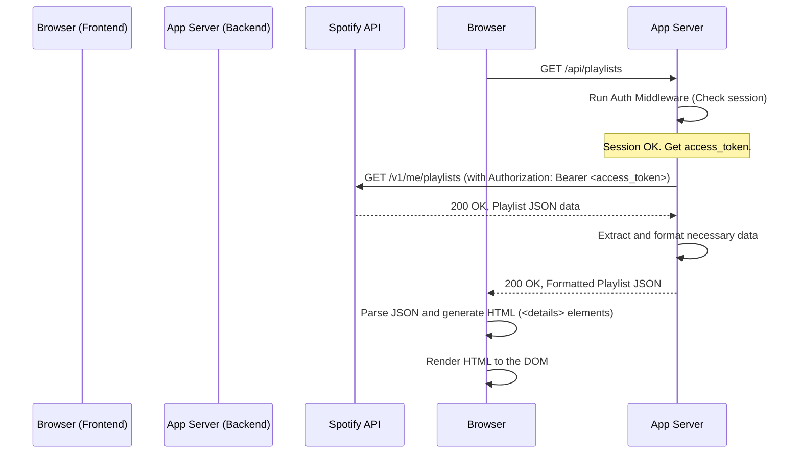

詳細仕様書（内部設計書） - F-02 プレイリスト一覧表示機能

#### 1. 機能概要
認証済みユーザーのSpotifyプレイリスト一覧を取得し、フロントエンドに表示する。フロントエンドは直接Spotify APIを呼び出さず、アクセストークンを安全に管理するバックエンドのプロキシAPIを経由してデータを取得する。取得したデータは、`<details>`タグを用いて動的にDOMを構築し、画面にレンダリングする。

#### 2. モジュール構成と役割
本機能は、責務の分離（SoC）の原則に基づき、以下のファイル構成で実装する。

| ファイル/ディレクトリ             | 役割                                                                                                 |
| :-------------------------------- | :--------------------------------------------------------------------------------------------------- |
| `public/index.html`               | プレイリスト一覧を描画するためのコンテナ要素（例: `<div id="playlist-container">`）を持つ。              |
| `public/js/ui.js`                 | プレイリストデータを元にDOM要素を生成・更新するUIロジックを実装する。                                  |
| `public/js/api.js`                | バックエンドのプロキシAPIを呼び出す`fetch`処理をカプセル化する。                                       |
| `public/js/main.js`               | ページの読み込み時に各モジュールを初期化し、プレイリスト取得の処理フロー全体を制御する。               |
| `routes/api.js`                   | フロントエンドからのデータ取得リクエストを受け付けるためのルーティング (`/api/playlists`) を定義する。 |
| `controllers/apiController.js`    | 実際にSpotify APIを呼び出し、必要なデータを整形してフロントエンドに返すビジネスロジックを実装する。   |
| `middleware/auth.js`              | `/api/*` へのリクエストが認証済み（セッションにアクセストークンが存在する）かを確認するミドルウェア。    |

#### 3. シーケンス図
フロントエンド、アプリケーションサーバー（バックエンド）、Spotify API間のデータ取得フローを示す。



#### 4. バックエンドAPI仕様 (プロキシ)

##### 4.1. エンドポイント定義
-   **URL:** `GET /api/playlists`
-   **説明:** ログイン中のユーザーが所有またはフォローしているプレイリストの一覧を取得する。

##### 4.2. 認証
このエンドポイントは、`middleware/auth.js`によって保護される。ミドルウェアは`req.session.access_token`の存在を確認し、存在しない場合は`401 Unauthorized`を返す。

##### 4.3. 処理詳細 (`controllers/apiController.js` -> `getPlaylists`)
1.  セッションからアクセストークン (`req.session.access_token`) を取得する。
2.  `axios`を使い、Spotify APIのエンドポイント `https://api.spotify.com/v1/me/playlists` にGETリクエストを送信する。
    -   **リクエストヘッダー:** `Authorization: 'Bearer ' + access_token`
    -   **クエリパラメータ:** `limit: 50` （ページネーション処理のため、一度に取得する最大数を指定）
3.  Spotify APIから受け取ったレスポンスボディ (`response.data.items`) を処理する。
4.  各プレイリストオブジェクトから、フロントエンドで必要な情報のみを抽出した新しいオブジェクトの配列を作成する。（下記4.4参照）
5.  レスポンスに`next`フィールド（次のページのURL）が存在する場合、そのURLに対してリクエストを繰り返し、全プレイリストを取得する。（下記7.1参照）
6.  全プレイリストを整形したデータ配列を、JSON形式でレスポンスとして返す。ステータスコードは`200`。

##### 4.4. レスポンスデータ構造 (整形後)
バックエンドがフロントエンドに返すJSON配列の各要素の形式。編集権限の判定に必要な情報も付与する。

```json
[
  {
    "id": "37i9dQZF1DXcBWIGoYBM5M",
    "name": "Today's Top Hits",
    "imageUrl": "https://i.scdn.co/image/ab67706f00000003b464b4923963a03492a4570d",
    "isEditable": false,
    "ownerId": "spotify"
  },
  {
    "id": "5SjA4s5sJ1aBcd2aA...",
    "name": "My Awesome Playlist",
    "imageUrl": "https://mosaic.scdn.co/640/ab67616d0000b2731...",
    "isEditable": true,
    "ownerId": "user_id_12345"
  }
]
```
-   `isEditable`: 楽曲の削除可否を判定するためのフラグ。`playlist.owner.id`が自身のIDと一致するか、`playlist.collaborative`が`true`の場合に`true`となる。（自身のユーザーIDは別途`/api/me`等で取得することを想定）

#### 5. フロントエンド実装詳細

##### 5.1. 処理の起点 (`main.js`)
1.  `DOMContentLoaded`イベントをリッスンし、イベント発火後に処理を開始する。
2.  `ui.js`のローディング表示関数を呼び出し、`#playlist-container`にローディングインジケーターを表示する。
3.  `api.js`の`fetchPlaylists()`関数を呼び出す。
4.  成功した場合、取得したプレイリストデータを`ui.js`の`renderPlaylists()`関数に渡して描画する。
5.  失敗した場合、`ui.js`のエラー表示関数を呼び出す。

##### 5.2. APIリクエスト処理 (`api.js`)
-   **`async function fetchPlaylists()`:**
    1.  `fetch('/api/playlists')` を実行する。
    2.  レスポンスが`ok`でなければエラーをスローする。
    3.  成功した場合、レスポンスを`JSON.parse()`して返す。

##### 5.3. DOM生成ロジック (`ui.js`)
-   **`function renderPlaylists(playlists)`:**
    1.  引数で受け取った`playlists`配列を`map()`でループ処理する。
    2.  各`playlist`オブジェクトに対して、以下のHTML文字列を生成する。
        ```html
        <details class="playlist-item" data-playlist-id="${playlist.id}" data-editable="${playlist.isEditable}">
            <summary class="playlist-summary">
                <input type="checkbox" class="item-checkbox" data-item-type="playlist" aria-label="Select playlist ${playlist.name}">
                
                <span class="playlist-title">${playlist.name}</span>
            </summary>
            <div class="tracks-container">
                <!-- F-03で楽曲リストがここに追加される -->
            </div>
        </details>
        ```
    3.  **ポイント:**
        -   `<details>`タグに`data-playlist-id`属性を持たせ、後の楽曲取得処理でIDを簡単に参照できるようにする。
        -   `data-editable`属性に編集可否フラグを設定し、F-03で楽曲チェックボックスの`disabled`状態を制御するために利用する。
        -   `imageUrl`が存在しない場合に備え、デフォルトの画像パスを指定するフォールバック処理を行う。
    4.  生成した全要素を結合し、コンテナ要素 (`#playlist-container`) の`innerHTML`として一括で挿入する。

#### 6. エラーハンドリング
-   **バックエンド:**
    -   Spotify API呼び出し時にエラーが発生した場合（例: トークン期限切れ、ネットワークエラー）、502 Bad Gatewayや401 Unauthorizedをフロントエンドに返す。サーバーコンソールには詳細なエラーログを出力する。
-   **フロントエンド:**
    -   `fetch`がネットワークエラーで失敗した場合 (`.catch`ブロック）、またはレスポンスのステータスが200番台でない場合、`#playlist-container`に「プレイリストの読み込みに失敗しました。ページを再読み込みしてください。」というエラーメッセージを表示する。
    -   いずれの場合も、ローディングインジケーターを必ず非表示にする。

#### 7. 考慮事項

##### 7.1. ページネーション
Spotify APIの`/v1/me/playlists`エンドポイントは、一度に最大50件までしか返さない。50件以上のプレイリストを持つユーザーに完全な体験を提供するため、バックエンド側でページネーション処理を実装する。
-   **実装方針:**
    1.  初回のAPIリクエスト後、レスポンスに`next`フィールド（次ページのURL）が存在するか確認する。
    2.  `next`が存在する限り、そのURLに対して追加のAPIリクエストを送信し、結果を配列に結合していく。
    3.  全てのページのデータを取得し終えた後、結合した完全なリストをフロントエンドに返す。
    -   これにより、フロントエンドはページネーションを意識することなく、常に全プレイリストを一度に受け取ることができる。