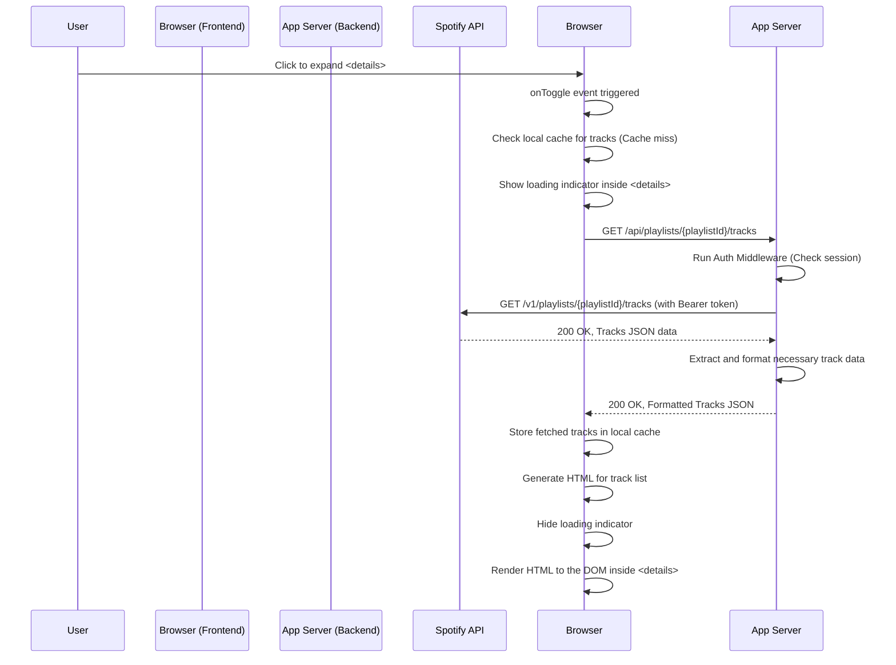

### 詳細仕様書（内部設計書） - F-03楽曲一覧表示機能

#### 1. 機能概要
F-02で表示されたプレイリストの`<details>`要素がユーザーによって展開された際に、該当プレイリストに含まれる楽曲の一覧を非同期で取得し、表示する。パフォーマンス向上のため、一度取得した楽曲データはフロントエンドでキャッシュし、再展開時にはAPIリクエストを行わずに表示する。

#### 2. モジュール構成と役割
F-02の構成をベースに、各モジュールの役割を拡張・明確化する。

| ファイル/ディレクトリ             | 役割                                                                                                 |
| :-------------------------------- | :--------------------------------------------------------------------------------------------------- |
| `public/js/ui.js`                 | 楽曲リストのDOM要素生成、およびローディングインジケーターの表示/非表示を制御する。                   |
| `public/js/api.js`                | バックエンドの楽曲取得プロキシAPI (`/api/playlists/:playlistId/tracks`) を呼び出す`fetch`処理を実装する。 |
| `public/js/main.js`               | `<details>`要素の`toggle`イベントを監視し、キャッシュの有無を判断して、`api.js`と`ui.js`の各関数を呼び出すコントローラーとしての役割を担う。 |
| `routes/api.js`                   | 楽曲取得のためのエンドポイント (`/api/playlists/:playlistId/tracks`) のルーティングを定義する。        |
| `controllers/apiController.js`    | 実際にSpotify APIを呼び出し、楽曲データを整形してフロントエンドに返すロジック (`getTracksInPlaylist`) を実装する。 |
| `middleware/auth.js`              | F-02と同様に、`/api/*` へのリクエストが認証済みかを確認する。                                        |

#### 3. シーケンス図
ユーザーが`<details>`を展開してから楽曲が表示されるまでのフローを示す。



#### 4. バックエンドAPI仕様 (プロキシ)

##### 4.1. エンドポイント定義
-   **URL:** `GET /api/playlists/:playlistId/tracks`
-   **説明:** 指定されたプレイリストIDに含まれる楽曲の一覧を取得する。

##### 4.2. 認証
このエンドポイントは、`middleware/auth.js`によって保護される。

##### 4.3. 処理詳細 (`controllers/apiController.js` -> `getTracksInPlaylist`)
1.  URLパラメータから`playlistId` (`req.params.playlistId`) を取得する。
2.  セッションからアクセストークン (`req.session.access_token`) を取得する。
3.  `axios`を使い、Spotify APIのエンドポイント `https://api.spotify.com/v1/playlists/${playlistId}/tracks` にGETリクエストを送信する。
    -   **リクエストヘッダー:** `Authorization: 'Bearer ' + access_token`
    -   **クエリパラメータ:**
        -   `fields`: `items(track(id,uri,name,artists(name),album(images)))` (必要なフィールドのみ取得し、レスポンスサイズを削減。削除処理に必要な`uri`も追加)
        -   `limit`: `100` (一度に取得する最大数)
4.  Spotify APIから受け取ったレスポンスボディ (`response.data.items`) を処理する。
5.  各`item`オブジェクトから、フロントエンドで必要な情報のみを抽出した新しいオブジェクトの配列を作成する。`item.track`が`null`の場合（ローカルファイルなど）はスキップする。
6.  レスポンスに`next`フィールドが存在する場合、そのURLに対してリクエストを繰り返し、全楽曲データを取得・結合する。（下記7.1参照）
7.  整形したデータ配列をJSON形式でレスポンスとして返す。ステータスコードは`200`。

##### 4.4. レスポンスデータ構造 (整形後)
バックエンドがフロントエンドに返すJSON配列の各要素の形式。

```json
[
  {
    "id": "4iV5W9uYEdYUVa79Axb7Rh",
    "uri": "spotify:track:4iV5W9uYEdYUVa79Axb7Rh",
    "name": "Blinding Lights",
    "artist": "The Weeknd",
    "imageUrl": "https://i.scdn.co/image/ab67616d0000b2738863bc11d2aa12b54f5aeb36"
  },
  {
    "id": "0VjIjW4GlUZAMYd2vXMi3b",
    "uri": "spotify:track:0VjIjW4GlUZAMYd2vXMi3b",
    "name": "As It Was",
    "artist": "Harry Styles",
    "imageUrl": "https://i.scdn.co/image/ab67616d0000b273b46f7409765414bb02a5b45d"
  }
]
```

#### 5. フロントエンド実装詳細

##### 5.1. イベントハンドリング (`main.js`)
1.  プレイリスト一覧のコンテナ要素 (`#playlist-container`) に対して、`toggle`イベントリスナーを1つ設定する（イベントデリゲーション）。
2.  イベントハンドラ内で、以下の処理を行う。
    a. イベントのターゲット (`event.target`) が`<details>`要素であり、かつ`open`プロパティが`true`（開かれた瞬間）であることを確認する。
    b. ターゲット要素に`data-loaded="true"`属性があるかチェックする。あれば処理を終了（キャッシュヒット）。
    c. `data-loaded`がなければ、以下の非同期処理を開始する。
        i. ターゲット要素内の楽曲コンテナ (`.tracks-container`) を取得し、ローディング表示を開始する (`ui.showLoading(container)`)。
        ii. ターゲット要素の`data-playlist-id`属性から`playlistId`を取得する。
        iii. `api.fetchTracks(playlistId)`を呼び出す。
        iv. **成功時 (`.then`):**
            - 取得した楽曲データを`trackCache`オブジェクトに保存する: `trackCache[playlistId] = tracks;`
            - `ui.renderTracks(tracks, container)`を呼び出し、DOMを生成・描画する。
            - ターゲット要素に`data-loaded="true"`属性を設定する。
        v. **失敗時 (`.catch`):**
            - `ui.showError(container, '楽曲の読み込みに失敗しました。')`を呼び出し、エラーメッセージを表示する。
        vi. **最終処理 (`.finally`):**
            - `ui.hideLoading(container)`を呼び出し、ローディング表示を解除する。

##### 5.2. キャッシュ機構 (`main.js`)
-   `main.js`のスコープ内にキャッシュ用のオブジェクトを定義する。
    ```javascript
    const trackCache = {}; // key: playlistId, value: array of track objects
    ```
-   APIからデータを取得後、`trackCache[playlistId] = tracks;`のように保存する。

##### 5.3. DOM生成ロジック (`ui.js`)
-   **`function renderTracks(tracks, containerElement)`:**
    1.  `containerElement`の中身を一度空にする。
    2.  `tracks`配列が空の場合は、「このプレイリストは空です。」というメッセージを表示する。
    3.  `tracks`配列をループ処理し、各`track`オブジェクトに対して以下のHTML文字列を生成する。
        ```html
        <div class="track-item" data-track-id="${track.id}" data-track-uri="${track.uri}">
            <input type="checkbox" class="item-checkbox" data-item-type="track" aria-label="Select track ${track.name}" ${isEditable ? '' : 'disabled'}>
            
            <span class="track-title">${track.name}</span>
            <span class="track-artist">${track.artist}</span>
        </div>
        ```
    4.  **ポイント:**
        -   `data-track-uri`属性にトラックURIを持たせ、F-05の削除処理で利用する。
        -   チェックボックスの`disabled`状態は、親の`<details>`要素の`data-editable`属性 (`isEditable`) を参照して決定する。
    5.  生成した全要素を`containerElement`に追加する。

#### 6. エラーハンドリング
-   **バックエンド:**
    -   Spotify API呼び出し時にエラーが発生した場合、502 Bad Gatewayなどをフロントエンドに返す。
-   **フロントエンド:**
    -   `fetch`が失敗した場合、該当する`<details>`要素内の`.tracks-container`に「楽曲の読み込みに失敗しました。」というエラーメッセージを表示する。
    -   ローディングインジケーターは必ず非表示にする。

#### 7. 考慮事項

##### 7.1. ページネーション
Spotify APIの`/v1/playlists/{playlist_id}/tracks`エンドポイントは、一度に最大100件までしか返さない。100件以上の楽曲を持つプレイリストに完全対応するため、バックエンド側でページネーション処理を実装する。
-   **実装方針:**
    1.  初回のAPIリクエスト後、レスポンスに`next`フィールド（次ページのURL）が存在するか確認する。
    2.  `next`が存在する限り、そのURLに対して追加のAPIリクエストを送信し、結果を配列に結合していく。
    3.  全てのページのデータを取得し終えた後、結合した完全なリストをフロントエンドに返す。
    -   これにより、フロントエンドはページネーションを意識することなく、常に全楽曲データを一度に受け取ることができる。