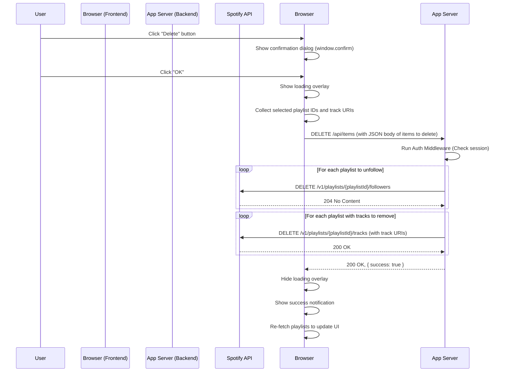

### 詳細仕様書（内部設計書） - F-05: アイテム削除機能

#### 1. 機能概要
ユーザーが選択したプレイリストや楽曲をSpotifyアカウントから削除する。フロントエンドで削除対象のアイテム情報を収集し、バックエンドのプロキシAPIにリクエストを送信する。バックエンドは受け取った情報に基づき、適切なSpotify APIエンドポイントを呼び出して削除処理を実行する。処理中はUIをロックし、完了後は結果をユーザーに通知して画面を更新する。

#### 2. モジュール構成と役割

| ファイル/ディレクトリ             | 役割                                                                                                 |
| :-------------------------------- | :--------------------------------------------------------------------------------------------------- |
| `public/js/main.js`               | Deleteボタンの`click`イベントを監視し、`ui.js`から削除対象リストを取得後、`api.js`の削除関数を呼び出すコントローラー役。 |
| `public/js/ui.js`                 | 選択されているアイテムのIDやURIをDOMから収集する。ローディングオーバーレイの表示/非表示、完了通知の表示を行う。 |
| `public/js/api.js`                | バックエンドの削除用プロキシAPI (`/api/items`) を呼び出す`fetch`処理を実装する。                       |
| `routes/api.js`                   | 削除処理のためのエンドポイント (`DELETE /api/items`) のルーティングを定義する。                        |
| `controllers/apiController.js`    | フロントエンドから受け取った削除対象リストに基づき、Spotify APIを呼び出すロジック (`deleteItems`) を実装する。 |
| `middleware/auth.js`              | F-02, F-03と同様に、`/api/*` へのリクエストが認証済みかを確認する。                                    |

#### 3. シーケンス図
ユーザーがDeleteボタンをクリックしてから処理が完了するまでのフローを示す。



#### 4. バックエンドAPI仕様 (プロキシ)

##### 4.1. エンドポイント定義
-   **URL:** `DELETE /api/items`
-   **説明:** 指定されたプレイリストと楽曲を削除する。

##### 4.2. 認証
このエンドポイントは、`middleware/auth.js`によって保護される。

##### 4.3. リクエストボディ構造
フロントエンドから送信されるJSON形式のボディ。

```json
{
  "playlists": [
    "37i9dQZF1DXcBWIGoYBM5M",
    "5SjA4s5sJ1aBcd2aA..."
  ],
  "tracks": {
    "playlistId_1": [
      "spotify:track:4iV5W9uYEdYUVa79Axb7Rh",
      "spotify:track:0VjIjW4GlUZAMYd2vXMi3b"
    ],
    "playlistId_2": [
      "spotify:track:..."
    ]
  }
}
```
-   `playlists`: フォロー解除するプレイリストIDの配列。
-   `tracks`: 削除する楽曲情報。キーがプレイリストID、値がそのプレイリストから削除する楽曲のURIの配列。

##### 4.4. 処理詳細 (`controllers/apiController.js` -> `deleteItems`)
1.  リクエストボディから`playlists`と`tracks`オブジェクトを取得する。
2.  セッションからアクセストークンを取得する。
3.  並列処理の準備: 全ての削除API呼び出しを`Promise.allSettled`で並列実行し、一部の失敗が他の処理を妨げないようにする。
4.  **プレイリストのフォロー解除:**
    -   `playlists`配列をループし、各`playlistId`に対してSpotify API (`DELETE /v1/playlists/${playlistId}/followers`) を呼び出すPromiseを作成する。
5.  **楽曲の削除:**
    -   `tracks`オブジェクトをループし、各`playlistId`とその`trackUris`配列に対して処理を行う。
    -   `trackUris`配列が100件を超える場合は、100件ずつのチャンクに分割する。
    -   各チャンクに対して、Spotify API (`DELETE /v1/playlists/${playlistId}/tracks`) を呼び出すPromiseを作成する。リクエストボディは以下の形式。
        ```json
        { "tracks": [{ "uri": "..." }, { "uri": "..." }] }
        ```
6.  `Promise.allSettled`で(4)と(5)で作成した全てのPromiseを実行する。
7.  結果を検証し、一つでも`rejected`があればエラーログを記録するが、クライアントには処理が完了したことを示す`200 OK`と成功ステータスを返す。（部分的な失敗は許容する設計）

#### 5. フロントエンド実装詳細

##### 5.1. イベントハンドリング (`main.js`)
1.  Deleteボタン (`#delete-button`) に`click`イベントリスナーを設定する。
2.  イベントハンドラ内で、以下の処理を行う。
    a. `window.confirm()`で最終確認を行う。ユーザーが「キャンセル」した場合は処理を中断する。
    b. `ui.showLoadingOverlay()`を呼び出し、UIをロックする。
    c. `ui.collectItemsToDelete()`を呼び出し、削除対象のアイテム情報を収集する。
    d. `api.deleteItems(items)`を呼び出し、バックエンドに削除リクエストを送信する。
    e. **成功時 (`.then`):**
        - `ui.showNotification('削除が完了しました。', 'success')`で成功を通知する。
        - プレイリスト一覧を再取得して画面を更新する (`fetchAndRenderPlaylists()`)。
    f. **失敗時 (`.catch`):**
        - `ui.showNotification('削除処理中にエラーが発生しました。', 'error')`で失敗を通知する。
    g. **最終処理 (`.finally`):**
        - `ui.hideLoadingOverlay()`を呼び出し、UIのロックを解除する。

##### 5.2. 削除対象の収集 (`ui.js` -> `collectItemsToDelete`)
1.  空の`playlists`配列と`tracks`オブジェクトを初期化する。
2.  **プレイリストの収集:**
    -   `document.querySelectorAll('.item-checkbox[data-item-type="playlist"]:checked')`で選択されたプレイリストのチェックボックスを取得する。
    -   各チェックボックスから親の`<details>`要素の`data-playlist-id`を取得し、`playlists`配列に追加する。
3.  **楽曲の収集:**
    -   `document.querySelectorAll('.item-checkbox[data-item-type="track"]:checked')`で選択された楽曲のチェックボックスを取得する。
    -   各チェックボックスについて、以下の処理を行う。
        i. 親の`.track-item`から`data-track-uri`を取得する。
        ii. さらに親の`<details>`要素から`data-playlist-id`を取得する。
        iii. `tracks`オブジェクト内に`playlistId`のキーがなければ、空の配列で初期化する。
        iv. `tracks[playlistId]`配列に、(i)で取得した楽曲URIを追加する。
4.  収集した`{ playlists, tracks }`オブジェクトを返す。

##### 5.3. APIリクエスト処理 (`api.js` -> `deleteItems`)
-   **`async function deleteItems(items)`:**
    1.  `fetch('/api/items', { ... })` を実行する。
        -   `method`: `'DELETE'`
        -   `headers`: `{ 'Content-Type': 'application/json' }`
        -   `body`: `JSON.stringify(items)`
    2.  レスポンスが`ok`でなければエラーをスローする。

#### 6. エラーハンドリング
-   **バックエンド:**
    -   Spotify APIから4xx/5xx系のエラーが返ってきた場合、サーバーコンソールに詳細なエラーログを出力する。フロントエンドには汎用的な500 Internal Server Errorを返す。
-   **フロントエンド:**
    -   `fetch`がネットワークエラーで失敗した場合、またはレスポンスのステータスが200番台でない場合、`catch`ブロックでエラー通知を表示する。
    -   ローディングオーバーレイは必ず非表示にする。

#### 7. 補足
-   **トランザクション:** Spotify APIには複数の操作をまとめるトランザクション機能はない。そのため、一部の削除が成功し、一部が失敗する可能性がある。本仕様では、処理完了後に画面を再描画することで、成功したアイテムが消え、失敗したアイテムが残るという結果整合性を採用する。
-   **楽曲URI:** Spotify APIで楽曲を特定する際は、IDだけでなく`spotify:track:ID`という形式のURIが必要になる。このURIはF-03の楽曲データ取得時にバックエンドから提供されるため、フロントエンドはDOMの`data-track-uri`属性からそれを読み取るだけでよい。