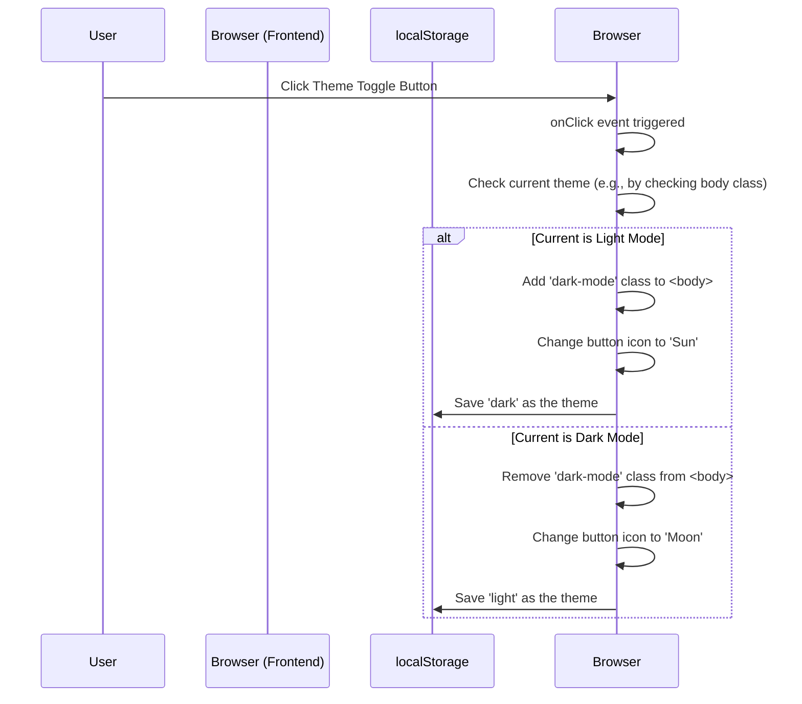
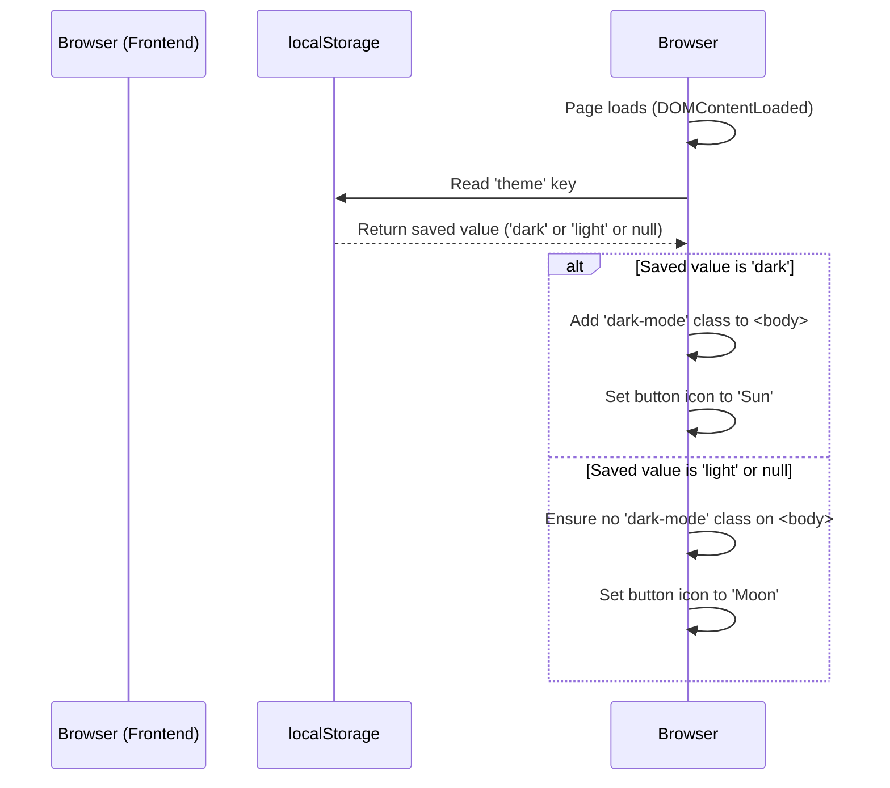

### 詳細仕様書（内部設計書） - F-06 テーマ切替機能

#### 1. 機能概要
アプリケーションの配色テーマを、ライトモードとダークモードで切り替える機能を提供する。この機能は純粋にフロントエンドのJavaScriptとCSSで完結する。ユーザーの選択したテーマはブラウザの`localStorage`に保存され、次回アクセス時にもその設定が維持される。

#### 2. モジュール構成と役割

| ファイル/ディレクトリ | 役割                                                                                             |
| :---------------------- | :----------------------------------------------------------------------------------------------- |
| `public/js/main.js`     | ページの初期化時に保存されたテーマを適用し、テーマ切替ボタンの`click`イベントを監視して`ui.js`の関数を呼び出すコントローラー役。 |
| `public/js/ui.js`       | 実際のDOM操作（`<body>`タグのクラス切り替え、ボタンアイコンの変更）と、`localStorage`への設定保存/読み込みを担当する。 |
| `public/index.html`     | テーマ切替ボタンのHTML要素 (`<button id="theme-toggle-button">`) を定義する。                      |
| `public/style.css`      | ライトモード（デフォルト）とダークモード（`.dark-mode`クラス）の配色スタイルを定義する。           |

#### 3. シーケンス図
ユーザーがテーマ切替ボタンをクリックした際の処理フローを示す。



ページ読み込み時の初期化フローも示す。



#### 4. フロントエンド実装詳細

##### 4.1. 処理の起点 (`main.js`)
1.  `DOMContentLoaded`イベントをリッスンし、イベント発火後に処理を開始する。
2.  `ui.initTheme()`を呼び出し、保存されているテーマ設定をページに適用する。
3.  テーマ切替ボタン (`#theme-toggle-button`) に`click`イベントリスナーを設定し、イベントハンドラとして`ui.toggleTheme()`を割り当てる。

##### 4.2. テーマ管理ロジック (`ui.js`)

-   **`function initTheme()`:**
    1.  `localStorage.getItem('theme')`で保存されたテーマ設定を取得する。
    2.  取得した値が`'dark'`の場合、`document.body.classList.add('dark-mode')`を実行し、ダークモードを適用する。
    3.  `updateThemeButtonIcon()`を呼び出して、現在のテーマに合ったアイコンを表示する。

-   **`function toggleTheme()`:**
    1.  `document.body.classList.toggle('dark-mode')`で、`<body>`タグの`.dark-mode`クラスの有無を切り替える。
    2.  `document.body.classList.contains('dark-mode')`で、切り替え後の状態を確認する。
    3.  **ダークモードになった場合:** `localStorage.setItem('theme', 'dark')`を実行して設定を保存する。
    4.  **ライトモードになった場合:** `localStorage.setItem('theme', 'light')`を実行して設定を保存する。
    5.  `updateThemeButtonIcon()`を呼び出して、ボタンのアイコンを更新する。

-   **`function updateThemeButtonIcon()`:**
    1.  テーマ切替ボタン要素を取得する。
    2.  `document.body.classList.contains('dark-mode')`で現在のテーマを判定する。
    3.  **ダークモードの場合:** ボタンのテキストコンテント（またはアイコン）を「☀️」に変更する。
    4.  **ライトモードの場合:** ボタンのテキストコンテント（またはアイコン）を「🌙」に変更する。

#### 5. HTML要素の定義 (`index.html`)
-   ヘッダー内にテーマ切替ボタンを配置する。
    ```html
    <header>
        <h1>Spotify Playlist Manager</h1>
        <button id="theme-toggle-button" aria-label="Toggle theme">🌙</button>
    </header>
    ```
-   `aria-label`属性を付与し、スクリーンリーダー利用者のアクセシビリティを確保する。

#### 6. CSSによるスタイリング (`style.css`)
-   CSSカスタムプロパティ（変数）を使用して、テーマの配色を一元管理する。
    ```css
    :root {
        /* Light Theme Variables */
        --bg-color: #ffffff;
        --text-color: #181818;
        --surface-color: #f4f4f9;
        --border-color: #dddddd;
        --primary-color: #1DB954;
    }

    body.dark-mode {
        /* Dark Theme Variables */
        --bg-color: #121212;
        --text-color: #e0e0e0;
        --surface-color: #181818;
        --border-color: #282828;
    }
    ```
-   各コンポーネントのスタイルは、これらのカスタムプロパティを参照して定義する。
    ```css
    body {
        background-color: var(--bg-color);
        color: var(--text-color);
        transition: background-color 0.2s, color 0.2s;
    }

    details {
        background-color: var(--surface-color);
        border: 1px solid var(--border-color);
    }
    /* ... 他の要素も同様に定義 ... */
    ```
-   これにより、テーマの切り替えは`<body>`タグのクラスを変更するだけで、サイト全体の配色が一括で変更される。

#### 7. エラーハンドリング
本機能はクライアントサイドのDOM操作と`localStorage`へのアクセスが中心であり、外部APIとの通信もないため、クリティカルなエラーは発生しにくい。
-   `localStorage`が利用できない環境（プライベートブラウジングモードの一部など）では、`getItem`/`setItem`がエラーをスローする可能性がある。`try...catch`ブロックで囲むことで、エラーが発生してもアプリケーションの他の機能が停止しないようにする。
    ```javascript
    try {
        localStorage.setItem('theme', 'dark');
    } catch (e) {
        console.warn('localStorage is not available.');
    }
    ```